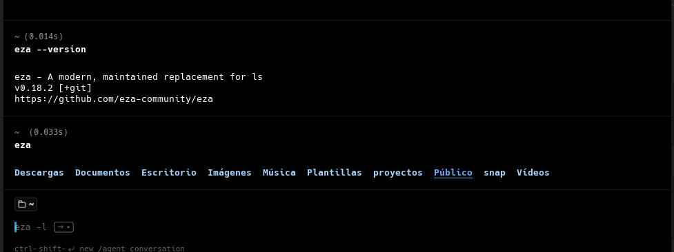

## **WARP**
Warp es una terminal moderna multiplataforma (Rust) orientada a productividad y colaboración. Incluye un editor de comandos interactivo estilo IDE, con entrada de texto enriquecida. Warp se ejecuta con renderizado por GPU (Metal/Vulkan/OpenGL) para alto rendimiento, y soporta shells populares (bash, zsh, fish en Linux, pwsh).

**Características**
- Sugerencias inteligentes de comandos basadas en IA
- Explicación y corrección de errores en tiempo real
- Agrupa cada comando junto con su salida en bloques, permitiendo copiar o navegar salidas completas fácilmente

**Instalación**

- Ingresar a la pagina https://www.warp.dev/linux-terminal y descargar el archivo .deb

- En la terminal ingresar a la carpeta de descargas donde se encuentra el archivo

- Ingresar el comando:

```
sudo apt install <archivo descargado>

```
- Una vez instalado, verificar con el comando. 

```
warp-terminal

```


## **EZA**
Es el reemplazo moderno del programa de linea de comandos ***ls***, basado en EXA, disponible para sistemas operativos Unix y Linux, con más funcionalidades y mantenimiento activo.

**Características**
- Uso de colores para mostrar información.
- Muestra los atributos extendidos de un archivo.
- Información del sistema de archivos como el inodo.
- Número de bloques.
- Fechas, horas de creación y modificación de archivos.
- Vista de arbol de los directorios (--tree)
 - Ver el estado de Git para un directorio. (también funciona en vista de árbol)

**Instalación Ubuntu**

***Opción 1:***
```
sudo apt install eza
```





## **BAT**
Nos muestra el contenido de un archivo, justo como cat, pero con la sintaxis resaltada para la mayoria de los lenguajes de programación.

**Características**
- Posee resaltado de sintaxis para varios lenguajes de programación.
- Elección de varios temas de colores para dicho resaltado.
- Incluye integración con Git para ver los cambios en el fichero.
- Hace el paginado de forma automática.
- Permite añadir nuevos temas y sintaxis para otros lenguajes no incluidos.

**Instalación**
-Realizar la actualizacion del repositorio
```
sudo apt update
```
-Instalar bat

```
sudo apt install bat
```
-Verificar la version instalada(EN UBUNTO EL EJECUTABLE SE LLAMA BATCAT Y NO SOLO BAT)

```
batcat --version
```


